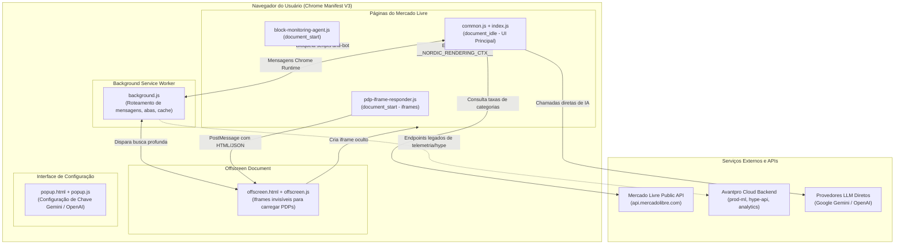
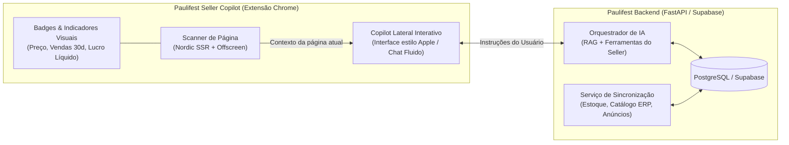

# Auditoria Técnica e Funcional Completa: Extensão Avantpro ML (Versão LC / Ultra)

> **Data da Auditoria:** 16 de Setembro de 2026  
> **Objeto de Análise:** Extensão de Navegador "Avantpro ML" (Pacote `avantpro lc`, Versão Manifest 7.24.0, Manifest V3)  
> **Objetivo:** Mapeamento de arquitetura, pontos de injeção, fluxo e coleta de dados, inventário de recursos visíveis, dependências e plano de replicação/integração para o **Paulifest Seller Copilot**.  
> **Diretriz:** Apenas análise e documentação. Nenhuma implementação de código de produção, alteração na extensão ou emulação de backend foi realizada.

---

## 1. Visão Geral e Arquitetura do Sistema

A extensão **Avantpro ML** é uma ferramenta de inteligência competitiva e automação para vendedores do Mercado Livre Brasil. A variante analisada (`avantpro lc`) é uma versão com engenharia reversa/desbloqueio ("Ultra Desbloqueado"), onde o controle de assinatura em nuvem foi desviado localmente e os serviços de inteligência artificial foram redirecionados para APIs públicas com chave fornecida pelo usuário.



---

## 2. Mapeamento de Arquivos e Estrutura

| Arquivo | Tamanho | Função Arquitetural |
| :--- | :--- | :--- |
| **`manifest.json`** | 3.4 KB | Manifesto MV3. Define permissões de abas, offscreen, storage, domínios autorizados e scripts injetados. |
| **`background.js`** | 124.6 KB | Service Worker. Gerencia comunicação entre abas, ciclo de vida do offscreen document, cache de sessões e rotas. |
| **`block-monitoring-agent.js`** | 2.1 KB | Injetado em `document_start`. Desativa ativamente os mecanismos de detecção de scraping e bot do Mercado Livre. |
| **`pdp-iframe-responder.js`** | 2.9 KB | Injetado em `document_start`. Opera exclusivamente dentro de iframes filhos para capturar a hidratação SSR de PDPs e responder ao offscreen. |
| **`offscreen.html` / `offscreen.js`** | 2.9 KB | Ambiente isolado com API DOM completa. Executa uma fila com concorrência máxima 2 para carregar páginas completas de produtos em segundo plano. |
| **`popup.html` / `popup.js`** | 8.6 KB | Painel da extensão. Permite configurar o provedor de IA (Google Gemini 1.5 Flash ou OpenAI GPT-4o-mini) e testar a conexão. |
| **`common.js`** | 1.96 MB | Pacote de bibliotecas base empacotadas (React, ReactDOM, SheetJS / XLSX para exportação de planilhas, bibliotecas de gráficos e componentes auxiliares). |
| **`index.js`** | 2.41 MB | O núcleo da aplicação. Contém toda a lógica de negócio, seletores DOM, componentes de UI, modais, menu flutuante e calculadora de lucro. |
| **`public/`** | Vários | Recursos estáticos: ícones de status (ativo/desabilitado), fontes woff/woff2 e imagens ilustrativas de vinculação. |

### Comparativo: Versão Original vs. Versão "LC"

A comparação direta entre a versão oficial e a versão `avantpro lc` revelou as seguintes alterações cirúrgicas:
1. **Bypass de Plano no `index.js`:** Na função responsável por checar o plano do usuário (`function g()`), foi inserido imediatamente `return "ultra";`. Isso ignora a verificação de token no servidor de autenticação `auth.avantprocloud.com.br` e libera todos os recursos de UI para nível Ultra.
2. **Substituição do Backend de IA no `index.js`:** O interceptador de requisições substituiu a rota remota `/openai/analysis` por chamadas diretas client-side `fetch()` para o Google Gemini (`gemini-1.5-flash`) ou OpenAI (`chat/completions`) utilizando a chave pessoal do usuário.
3. **Novo Popup de Configuração (`popup.html` / `popup.js`):** Criação de uma interface para inserção, teste e armazenamento local (`chrome.storage.local`) das chaves de API da OpenAI e do Google.
4. **Modificação do `manifest.json`:** Adição de `popup.html` como popup padrão, inclusão dos hosts `generativelanguage.googleapis.com` e `api.openai.com`, e remoção da chave de integridade (`key`) e URL de atualização automática (`update_url`) para permitir execução contínua em modo desenvolvedor descompactado.

---

## 3. Pontos de Injeção e Manipulação do DOM

A extensão opera sobre o domínio `*.mercadolivre.com.br/*` com exclusão expressa de rotas de desenvolvedores (`developers.mercadolivre.com.br`) e telas de desafio/captcha (`/captcha/wall*`, `*/account-verification*`).

### 3.1. Scripts Injetados e Momento de Execução

1. **`block-monitoring-agent.js` (`run_at: document_start`):**
   - Roda antes de qualquer elemento HTML ser processado pelo navegador.
   - Localiza e destrói scripts e links com a assinatura `suspicious-traffic-frontend`, `__WEB_MONITORING_AGENT_INIT__` e `__WEB_MONITORING_AGENT__`.
   - Registra um `MutationObserver` no `document.documentElement` para interceptar e remover dinamicamente qualquer nó filho que tente carregar esses scripts de monitoramento do Mercado Livre.
2. **`pdp-iframe-responder.js` (`run_at: document_start`):**
   - Verifica se está rodando dentro de um iframe (`window.top !== window`).
   - Avalia a existência de uma hash específica na URL: `#...&__avantpro_probe=<token>`.
   - Se identificado como sonda de extração, aguarda a inicialização do contexto SSR e envia os dados brutos para o processo pai via `window.parent.postMessage`.
3. **`common.js` e `index.js` (`run_at: document_idle`):**
   - Executam após o carregamento estrutural da página.
   - Detectam a rota atual (busca, PDP, catálogo, tendências ou painel do vendedor) e acoplam nós de montagem React no DOM do Mercado Livre.

### 3.2. Seletores Alvo no Mercado Livre

A extensão ancora sua interface em classes do design system oficial do Mercado Livre (Andes / Poly / Nordic):

- **Páginas de Busca (`/lista/`, `/search/`):**
  - Card de produto: `.poly-card`, `.ui-search-layout--grid__grid > .ui-recommendations-card`, `.ui-search-result`
  - Título e link: `.poly-component__title a, a.poly-component__title`
  - Preço: `.poly-component__price`, `.poly-price__current`, `.andes-money-amount`
  - Barra de ações e cabeçalho: Injeta `.avantpro-search-actions-container` acima dos filtros e lista de produtos.
- **Página de Detalhe do Produto - PDP (`produto.mercadolivre.com.br/MLB-...`):**
  - Caixa de compra principal: `.ui-pdp-buybox`, `.ui-pdp-container`
  - Variações: `.ui-pdp-variations`, `.ui-pdp-variations__picker`
  - Avaliações e reputação: `.ui-pdp-review__label`, `.ui-pdp-header__info`
- **Painel de Anúncios do Vendedor (`mercadolivre.com.br/anuncios/lista`):**
  - Linhas da tabela de anúncios: `.sc-item-rows .sc-list-item-row:not(.avantload)`
  - Identificador do anúncio: `.sc-list-item-row-description__id`
  - Menu de ações secundárias: `.sc-list-item-row-secondary-actions-trigger`
- **Menu Flutuante Global:**
  - Injeta um botão fixo no canto inferior direito (`.avantpro-tools-button`) acoplado ao contêiner de menu expansível (`.avantpro-tools-body`).

---

## 4. Mapeamento de Coleta e Origem dos Dados

A extensão utiliza 5 camadas distintas para obter dados:

```
┌────────────────────────────────────────────────────────────────────────┐
│                      CAMADAS DE COLETA DE DADOS                        │
├────────────────────────────────┬───────────────────────────────────────┤
│ Camada 1: SSR Context          │ <script id="__NORDIC_RENDERING_CTX__">│
│ Camada 2: Analytics Scripts    │ melidata("add", "event_data", {...})  │
│ Camada 3: DOM Scraping         │ Classes .poly-*, .andes-*, .ui-pdp-*  │
│ Camada 4: Offscreen Iframe     │ Render oculto de PDPs (Probe Token)   │
│ Camada 5: APIs Oficiais ML     │ api.mercadolibre.com/categories/{id}  │
└────────────────────────────────┴───────────────────────────────────────┘
```

### 4.1. Camada 1: O Contexto Nordic SSR (`__NORDIC_RENDERING_CTX__`)
O Mercado Livre utiliza renderização híbrida server-side via plataforma interna chamada *Nordic*. No HTML inicial de todas as páginas de busca e produto, há uma tag de script:
```html
<script id="__NORDIC_RENDERING_CTX__">
  _n.ctx.r = { appProps: { pageProps: { initialState: { ... } } } };
  _n.ctx.r.assets = ...
</script>
```
A extensão faz o parse via regex dessa string JSON e extrai diretamente:
- **`initialState.results`:** Lista estruturada de cada produto exibido na busca (`POLYCARD`), contendo ID exato (`MLB...`), preço atual, preço original, flags de frete Full, flag de anúncio patrocinado (`ads_promotions`), medalha do vendedor, contagem de avaliações e ID da categoria.
- **Data de Início (`start_time` / `date_created`):** Registros de timestamp originais de publicação do anúncio.
- **Quantidade Vendida (`sold_quantity`):** Número bruto de itens vendidos (frequentemente presente no payload de hidratação mesmo quando omitido do texto visível na busca).

### 4.2. Camada 2: Extração de Eventos Melidata
O Mercado Livre envia métricas internas via script de telemetria `melidata`:
```javascript
melidata("add", "event_data", { ... });
```
A extensão busca por essas declarações no DOM para correlacionar IDs de catálogo, IDs de itens concorrentes e identificar se o usuário atual está logado e participando daquele anúncio.

### 4.3. Camada 3: Scraping Direto de Componentes de Interface
Para elementos que mudam após a renderização (como seletores de variação de cor/tamanho), a extensão lê diretamente elementos `.andes-money-amount` e nós de imagem da galeria `.ui-pdp-gallery`.

### 4.4. Camada 4: Carregamento Oculto via Offscreen Iframe Document
Quando a página de busca não traz os dados profundos de um produto (ex: data exata de criação, faturamento total do item, vencedor do catálogo ou saúde do anúncio), a extensão não faz um simples `fetch()` (que seria bloqueado por CORS ou captchas). Em vez disso:
1. O Content Script envia uma mensagem `FETCH_PDP_VIA_OFFSCREEN` ao Background Worker.
2. O Background Worker repassa ao `offscreen.html`.
3. O Offscreen injeta um `<iframe>` invisível (1px por 1px, opacidade 0) apontando para:
   `https://produto.mercadolivre.com.br/MLB-XXXX#__avantpro_probe=UUID_TOKEN`
4. O script `pdp-iframe-responder.js` (que já roda em todos os frames) reconhece a hash, aguarda a hidratação do `__NORDIC_RENDERING_CTX__`, empacota o HTML e os dados do produto, e faz um `postMessage` de volta ao offscreen.
5. O offscreen destrói o iframe e devolve o resultado sanitizado para o usuário.
6. Uma fila interna com `maxConcurrent = 2` garante que nunca haja mais de dois iframes simultâneos, evitando throttling ou detecção.

### 4.5. Camada 5: APIs Públicas do Mercado Livre
Para cálculo de comissões, a extensão consulta diretamente:
- `https://api.mercadolibre.com/categories/{CATEGORY_ID}` para mapear a árvore da categoria e identificar taxas de venda aplicáveis.

---

## 5. Inventário Detalhado de Funcionalidades Visíveis

Abaixo está o catálogo minucioso de cada funcionalidade disponível para o usuário final, organizada por contexto de exibição e módulo de operação.

### 5.1. Barra de Ações e Métricas na Página de Busca (`/lista/`, `/search/`)

| Funcionalidade | Onde Aparece | O que Mostra na Interface | Origem do Dado |
| :--- | :--- | :--- | :--- |
| **Resumo de Métricas da Busca** | Topo da página de resultados de busca | Faturamento total estimado da página, média de faturamento por anúncio, preço médio, total de anúncios orgânicos vs. patrocinados. | Cálculo em memória agregando os itens da página extraídos do `__NORDIC_RENDERING_CTX__`. |
| **Distribuição de Medalhas e Estados** | Painel retrátil na barra superior | Gráficos de barra/pizza mostrando distribuição de vendedores por medalha (Líder, Gold, Platinum) e concentração geográfica (SP, PR, RJ, etc.). | Extração de metadados do vendedor contidos nos cards de produto da busca. |
| **Ordenação por Top Vendas** | Botão de alternância na barra superior | Reordena visualmente no DOM os cards de produtos da busca pela quantidade estimada de vendas ou faturamento. | Manipulação do DOM reordenando os nós de acordo com o campo `sales` / `sold_quantity`. |
| **Filtro por Faturamento (Maior/Menor)** | Botões rápidos na barra de busca | Destaca ou filtra apenas anúncios com faturamento acima ou abaixo da média do nicho. | Filtro computado localmente com base no preço x estimativa de vendas. |
| **Filtro por Vendedores de Catálogo** | Seletor de faixas na busca | Segmenta catálogos por quantidade de concorrentes (1-5, 6-10, 11-30, >30 concorrentes). | Extração do selo de catálogo e metadados de concorrência contidos no item. |
| **Nuvem e Ranking de Palavras-Chave** | Modal acionado pelo botão "Palavras-chave" | Lista ordenada das palavras mais frequentes nos títulos dos concorrentes com contagem de repetições. | Algoritmo local em JS: quebra os títulos dos produtos, remove stopwords em português e ranqueia frequências. |
| **Exportação para Excel (.xlsx)** | Botão "Exportar dados" | Gera e baixa automaticamente arquivo `.xlsx` com todas as colunas de produtos da página (ID, Título, Preço, Vendas 30d, Faturamento, Link, Medalha, Frete). | Processamento local utilizando a biblioteca empacotada **SheetJS (xlsx)**. |
| **Análise de Busca com IA** | Botão com ícone de faísca na barra de busca | Diagnóstico em texto com resumo do nicho, oportunidades de diferenciação, faixa de preço recomendada e gargalos competitivos. | Chamada à API de LLM (Gemini 1.5 Flash ou GPT-4o-mini) enviando os títulos e preços dos produtos extraídos da página. |

### 5.2. Badges e Informações Adicionadas em Cada Card de Produto na Busca

| Funcionalidade | Onde Aparece | O que Mostra na Interface | Origem do Dado |
| :--- | :--- | :--- | :--- |
| **Badge de Vendas 30 Dias** | Em cima ou abaixo do preço no card do produto | "Vendas 30d: ~X un" com cor indicativa de volume. | Projeção calculada com base no acumulado total dividido pela idade do anúncio normalizada para 30 dias. |
| **Badge de Faturamento Estimado** | Acoplado ao card do produto | "Faturando R$ X.XXX,XX" com métrica estimada do produto. | Multiplicação do preço atual do card pela estimativa de vendas de 30 dias. |
| **Data de Criação e Idade do Anúncio** | Rodapé do card do produto | "Criado em DD/MM/AAAA (X dias)" com badge verde (<180d), amarelo (180-365d) ou cinza (>365d). | Extraído de `start_time` / `date_created` do payload SSR ou via sonda offscreen. |
| **Botão "Adicionar ao Comparador"** | Ícone de balança no canto do card | Permite selecionar até 3 anúncios para análise comparativa simultânea. | Estado mantido no `localStorage` / `chrome.storage.local`. |
| **Indicador de Tipo de Anúncio** | Badge nos atributos do card | Identificação visual se o anúncio é Clássico ou Premium e se possui envio Full. | Metadados do item extraídos de `listing_type_id` e `shipping.logistic_type`. |
| **Ação "Copiar Título"** | Botão rápido de prancheta no card | Copia com um clique o título exato do concorrente para a área de transferência. | `navigator.clipboard.writeText` direto do nó do título. |

### 5.3. Painel Avantpro na Página de Detalhe do Produto (PDP)

| Funcionalidade | Onde Aparece | O que Mostra na Interface | Origem do Dado |
| :--- | :--- | :--- | :--- |
| **Card de Métricas de Vendas e Faturamento** | Bloco lateral abaixo da buybox | Total de vendas acumuladas, média diária de vendas, vendas nos últimos 30 dias e receita bruta total gerada desde a criação. | Extração de `initialState` da página de produto e cálculo matemático temporal. |
| **Calculadora de Contribuição e Lucro Líquido** | Bloco expansível no painel do produto | Campos para inserir custo do produto (CMV), alíquota de impostos (Simples/Lucro Presumido) e custo de embalagem/frete. Exibe lucro líquido em R$ e margem percentual. | Algoritmo financeiro local que deduz as taxas reais do ML (Clássico/Premium + taxa fixa de itens < R$ 79) e impostos do preço de venda. |
| **Simulador de Taxas ML (Clássico vs. Premium)** | Tabela de tarifas | Taxa percentual da categoria específica do anúncio e valor em reais retido pelo Mercado Livre em cada modalidade. | Regras tarifárias do ML combinadas com a API pública de categorias e preço do produto. |
| **Estimativa de Visitas e Conversão** | Indicador métrico | Projeção do volume mensal de visualizações daquele anúncio e taxa estimada de conversão (%). | Estimativa calculada cruzando a taxa média de conversão da categoria com o volume de vendas real. |
| **Diagnóstico de Pontos Negativos** | Card de alertas de qualidade | Alerta se o anúncio possui menos de 5 fotos, se falta descrição em texto puro, ou se a saúde do anúncio está abaixo do ideal. | Inspeção do DOM da galeria (`.ui-pdp-gallery`) e da seção de descrição do item. |
| **Painel de Vencedor do Catálogo** | Exibido apenas em produtos de catálogo (`/p/MLB...`) | Nome/ID do vendedor ganhador da Buy Box, preço do ganhador e "Preço para Ganhar" (`priceToWin`). | Extração de metadados da Buy Box de catálogo e dados de concorrência embutidos no SSR. |

### 5.4. Menu Flutuante Global de Ferramentas (Quick Tools)

Acessado pelo botão flutuante com o logotipo da extensão no canto inferior direito da tela. Organizado em 4 abas:

#### A. Categoria "Produto"
1. **Calculadora de Contribuição:** Abre modal completo de precificação permitindo simular cenários de frete grátis, taxas de cartão, comissão e lucro para o item ativo.
2. **Métricas do Anúncio:** Exibe gráfico com projeção de faturamento bruto, vendas diárias e tempo de permanência do anúncio.
3. **Gerador de EANs (Código de Barras):** Gera códigos EAN-13 válidos com cálculo matemático exato do dígito verificador (checksum módulo 10), permitindo cópia rápida para novos cadastros.

#### B. Categoria "Análise"
1. **Teste A/B de Anúncios:** Permite criar grupos de teste para alternar títulos e fotos principais em anúncios do próprio vendedor logado, acompanhando variações de visitas e vendas ao longo dos dias.
2. **Rastreio de ADS:** Identifica anúncios do vendedor ou concorrentes que estão rodando campanhas de Product Ads e monitora sua frequência de exibição.
3. **Tendências do Mercado Livre:** Atalho integrado que abre dados analíticos de termos mais buscados e pesquisas em ascensão na categoria atual.
4. **Avantpro Hype:** Módulo de monitoramento de termos quentes e picos repentinos de demanda no e-commerce.

#### C. Categoria "IA" (Inteligência Artificial)
1. **Publicar com IA:** Conexão com o microfrontend de criação de anúncios para gerar título, descrição, ficha técnica e sugestão de preço em etapa única.
2. **Gerador de Títulos:** Sugere 5 variações de títulos de alta conversão respeitando o limite de 60 caracteres do Mercado Livre, utilizando palavras-chave de cauda longa do nicho.
3. **Gerador de Descrição:** Produz estrutura comercial pronta para descrição do produto com benefícios, ficha técnica resumida e garantia.
4. **Melhorar Descrição:** Recebe a descrição atual do anúncio concorrente ou próprio e reescreve com linguagem persuasiva (Copywriting), eliminando erros e ambiguidades.
5. **Quebra de Objeções:** Gera respostas prontas e persuasivas para as perguntas mais comuns de clientes sobre aquele produto específico.
6. **Editor de Fotos:** Utilitário para corte, ajuste de proporção e remoção de fundos para fotos de catálogo.

#### D. Categoria "Pesquisa"
1. **Análise de Mercado:** Panorama macroeconômico do termo pesquisado (barreiras de entrada, concentração de faturamento nos top 5 vendedores).
2. **Comparador de Anúncios:** Tabela lado a lado com até 3 produtos selecionados comparando preço, tipo de anúncio, vendas 30d, faturamento, frete e número de fotos.
3. **Palavras-chave:** Extração em tempo real das palavras-chave mais citadas nos 50 primeiros resultados de busca.
4. **Planilha de Lucratividade:** Exportador dos dados analisados diretamente para arquivo `.xlsx` do Excel.

### 5.5. Painel do Vendedor no Mercado Livre (`/anuncios/lista`)

- **Injeção de Métricas Inline:** Em cada linha da tabela oficial de anúncios do vendedor (`.sc-list-item-row`), a extensão injeta métricas de taxa de comissão individual, sugestão de melhoria de preço e botão para inclusão direta em testes A/B.

---

## 6. Dependências Externas e Serviços

### 6.1. Domínios de Nuvem Avantpro (Infraestrutura Original)

| Domínio / Serviço | Finalidade Original |
| :--- | :--- |
| `https://auth.avantprocloud.com.br` | Autenticação de usuários, login OAuth com Mercado Livre e validação de licenças/planos. |
| `https://prod-ml.avantprocloud.com.br` | Backend principal: agregação de métricas históricas de vendas de vendedores do ML. |
| `https://vntpr-scrapo-pub149.avantprocloud.com.br` | Cluster de scraping para dados que não podem ser obtidos client-side. |
| `https://hype-api.avantprocloud.com.br/v1` | Base proprietária de palavras-chave quentes e volume de buscas do Mercado Livre. |
| `https://ai-analysis.avantprocloud.com.br/search-analysis` | Gateway de IA que processava prompts nos servidores da Avantpro antes de responder à extensão. |
| `https://posthog.avantprocloud.com.br` | Rastreamento de telemetria, erros e engajamento dos usuários. |
| `https://analytics.avantprocloud.com.br` | Dashboard web externo com relatórios consolidados de contas conectadas. |

### 6.2. APIs do Mercado Livre

- `https://api.mercadolibre.com/categories/{id}`: Consulta pública de detalhes e regras de categoria.
- Páginas navegadas pelo próprio usuário (`produto.mercadolivre.com.br`, `lista.mercadolivre.com.br`, `tendencias.mercadolivre.com.br`).

### 6.3. Provedores de IA (Versão Desbloqueada LC)

- `https://generativelanguage.googleapis.com/v1beta/models/gemini-1.5-flash:generateContent?key={USER_KEY}`
- `https://api.openai.com/v1/chat/completions` (Modelo `gpt-4o-mini`)

---

## 7. O que é Reproduzível de Forma Independente vs. O que Requer Backend Privado

```
┌────────────────────────────────────────────────────────────────────────┐
│               VIABILIDADE DE REPRODUÇÃO INDEPENDENTE                  │
├──────────────────────────────────┬─────────────────────────────────────┤
│ 100% VIÁVEL NO CLIENT-SIDE       │ REQUER BACKEND / BANCO PRÓPRIO      │
├──────────────────────────────────┼─────────────────────────────────────┤
│ • Parse de SSR (__NORDIC_CTX__)  │ • Histórico de vendas ao longo de   │
│ • Bloqueio anti-bot ML           │   meses (time-series diária)        │
│ • Offscreen iframe probing       │ • Rastreamento contínuo de ADS sem  │
│ • Nuvem de palavras-chave da busca│   o usuário estar na página         │
│ • Calculadora de lucro líquido   │ • Base de Hype consolidada nacional │
│ • Comparador de anúncios         │ • Armazenamento centralizado de     │
│ • Exportação para Excel (.xlsx)  │   contas e múltiplos marketplaces   │
│ • Gerador de EAN-13 com checksum │                                     │
│ • Prompts de IA com LLMs         │                                     │
└──────────────────────────────────┴─────────────────────────────────────┘
```

### 7.1. Recursos 100% Reproduzíveis no Navegador (Sem Backend Privado)

1. **Extração de Dados em Tempo Real (Scraping Resiliente):**
   - A técnica de extração do `__NORDIC_RENDERING_CTX__` e a remoção de scripts com `block-monitoring-agent.js` não dependem de nenhum servidor. Pode ser implementada em TypeScript puro dentro de uma nova extensão.
2. **Sonda Offscreen para Informações Profundas:**
   - O mecanismo de carregar PDPs via `chrome.offscreen` com iframes e tokens `#...&probe=` funciona integralmente na máquina do usuário aproveitando a sessão já autenticada no Mercado Livre.
3. **Análise de Títulos e SEO de Busca:**
   - A contagem de frequência de termos, detecção de padrões de títulos e extração de palavras-chave de cauda longa são cálculos estritamente locais.
4. **Calculadora Financeira e Simulador de Margem:**
   - Todo o cálculo de taxa clássico/premium, frete fixo abaixo de R$ 79 e dedução de alíquota tributária pode ser embutido na extensão.
5. **Comparador de Anúncios e Exportador XLSX:**
   - Comparação visual lado a lado e geração de planilhas Excel utilizam apenas a memória do navegador (`chrome.storage.local` e SheetJS).
6. **Gerador de EAN-13:**
   - É um algoritmo determinístico de 10 linhas de código (cálculo do dígito verificador ponderado por 1 e 3 mod 10).
7. **Recursos de IA (Títulos, Descrições, Objeções, Análise de Busca):**
   - Podem ser conectados diretamente a modelos modernos de alta performance e baixo custo (Gemini 2.5 Flash, GPT-4o-mini ou Claude 3.5 Haiku) via chave de API própria ou backend próprio.

### 7.2. Recursos que Exigem Backend Próprio

1. **Série Histórica Contínua:** Saber exatamente quantos itens foram vendidos em cada dia do mês passado (sem ser uma estimativa calculada pela data de criação) requer rotinas automáticas de coleta diária que guardem o saldo em banco de dados relacional.
2. **Monitoramento de Anúncios Patrocinados (Product Ads):** Para alertar o vendedor sobre oscilações na concorrência de ADS quando o navegador estiver fechado, é necessário um crawler em servidor.
3. **Histórico Consolidado de Tendências (Hype):** Acompanhamento de termos que estão crescendo a nível Brasil ao longo das semanas.

---

## 8. Sugestão de Integração ao Futuro "Paulifest Seller Copilot"

Com base na auditoria da Avantpro, podemos desenhar a arquitetura recomendada para o **Paulifest Seller Copilot**, superando as limitações da extensão analisada e integrando-a ao ecossistema da Paulifest.



### 8.1. Arquitetura Recomendada

1. **Stack da Extensão:**
   - TypeScript + Vite + Manifest V3.
   - Design System inspirado no padrão Apple / Emil Kowalski (transições físicas com springs, microinterações refinadas, tipografia legível, modo escuro/claro elegante).
   - Sidebar retrátil nativa (`chrome.sidePanel` ou Web Component isolado com Shadow DOM para não sofrer interferência do CSS do Mercado Livre).
2. **Motor de Extração Aprimorado:**
   - Adotar o padrão comprovado de leitura do `__NORDIC_RENDERING_CTX__` como fonte primária de dados.
   - Adotar o `block-monitoring-agent` para prevenir atritos com a proteção anti-scraping do ML.
   - Implementar fila assíncrona inteligente com `chrome.offscreen` para enriquecimento de dados sob demanda.

### 8.2. O Diferencial: Do "Painel de Métricas" para um "Copilot Real"

Enquanto a Avantpro atua predominantemente como uma ferramenta estática de métricas e formulários pontuais, o **Paulifest Seller Copilot** pode se posicionar como um assistente de ação proativo:

1. **Copilot Ciente do Contexto (Context-Aware Assistant):**
   - Ao abrir uma página de busca ou anúncio concorrente, o Copilot já sabe exatamente o que está na tela: *"Você está olhando o anúncio líder deste nicho. Ele vende R$ 42.000/mês a R$ 89,90 no Premium. Seu custo no ERP para este produto é R$ 32,00. Quer que eu crie uma estratégia para superá-lo?"*
2. **Precificação com Dados Reais de Estoque e Margem Paulifest:**
   - A calculadora não precisa exigir que o vendedor digite custo do produto, alíquotas e frete toda vez. A extensão pode se comunicar com a base do vendedor na Paulifest e preencher automaticamente os custos reais de atacado/distribuição.
3. **Análise de Avaliações Negativas de Concorrentes:**
   - Coletar as avaliações de 1 e 2 estrelas dos principais concorrentes na busca e gerar um resumo automático: *"Os compradores deste produto reclamam de fragilidade na alça e demora na entrega. No seu anúncio, destaque material reforçado e envio no mesmo dia."*
4. **Criação de Anúncios em Lote com Validação de Regras do ML:**
   - Geração de pacote completo de anúncio (Título dentro de 60 caracteres sem palavras banidas pelo ML, descrição com garantia e atributos de ficha técnica padronizados).
5. **Automação de Respostas Inteligentes no Pós-Venda:**
   - Assistente inteligente dentro das perguntas do anúncio e mensagens pós-venda sugerindo respostas personalizadas baseadas nas regras do vendedor.

---

## 9. Conclusão da Auditoria

A extensão Avantpro ML baseia seu sucesso em uma engenhosa engenharia reversa do frontend do Mercado Livre: ela aproveita a hidratação SSR (`__NORDIC_RENDERING_CTX__`), desativa scripts anti-bot e utiliza iframes ocultos em offscreen documents para extrair dados detalhados sem depender de contas oficiais de desenvolvedor ou APIs restritas.

Para o **Paulifest Seller Copilot**, todos os pilares essenciais de coleta, cálculo e inteligência podem ser reproduzidos com padrões modernos e limpos, eliminando o código ofuscado legado e integrando uma camada de Copilot conversacional muito superior às ferramentas estáticas do mercado.
