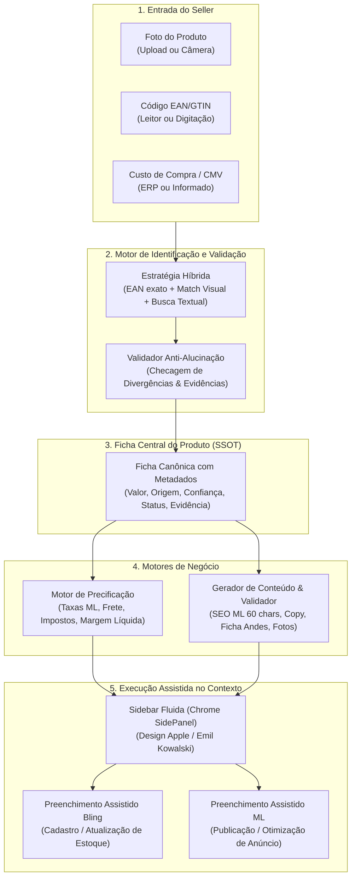
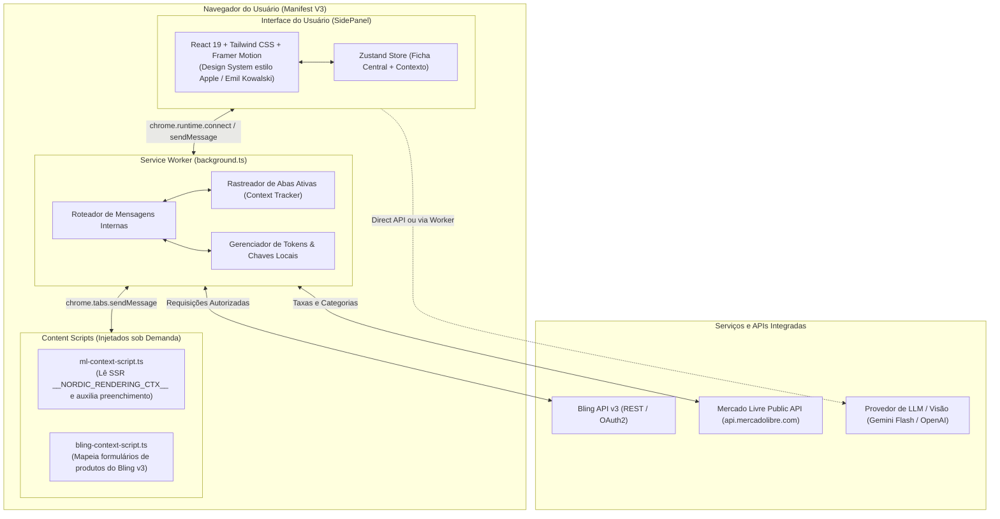
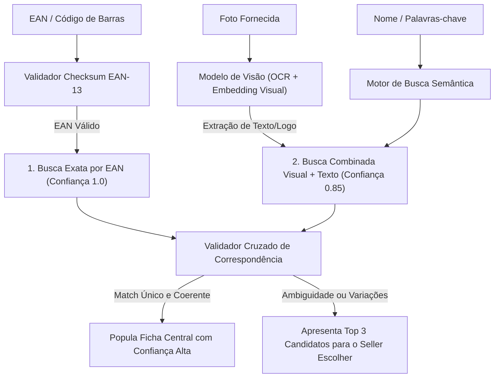
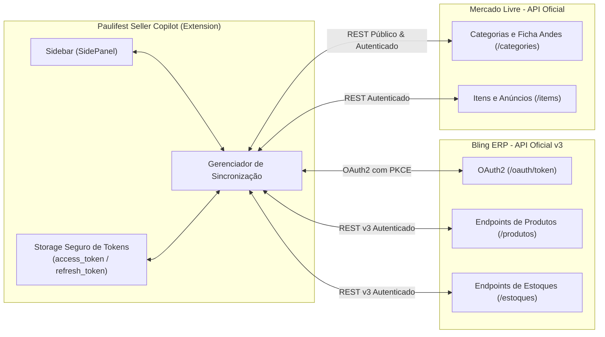
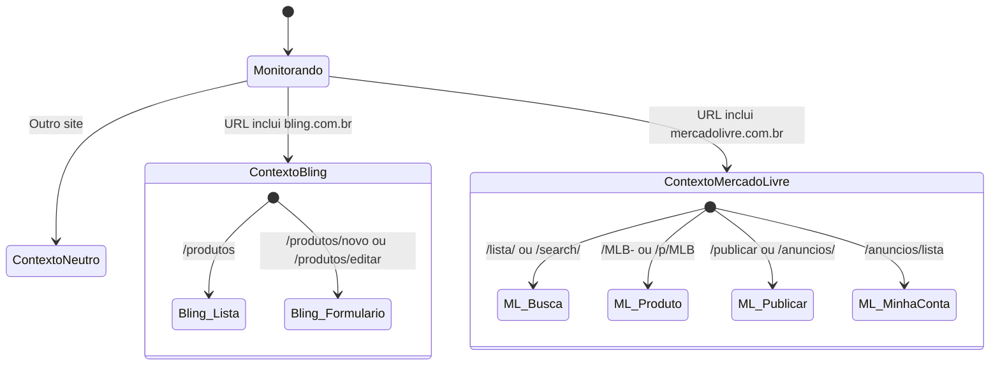

# Especificação Técnica V1: Paulifest Seller Copilot

> **Status:** Proposta Arquitetural e Especificação Funcional (V1)  
> **Data:** Setembro de 2026  
> **Documento de Referência:** [docs/AUDITORIA_AVANTPRO.md](file:///c:/Users/gusta/Paulifest-Seller-Copilot/docs/AUDITORIA_AVANTPRO.md)  
> **Princípio Fundamental:** Extensão oficial, transparente e resiliente. **Zero cópia de código, endpoints privados ou técnicas ilícitas.** Foco em assistência contextual inteligente, dados auditáveis com evidências e integração ponta a ponta (Bling ERP ↔ Mercado Livre).

---

## 1. Visão Geral e Proposta de Valor

O **Paulifest Seller Copilot** é uma extensão de navegador (Manifest V3) baseada em uma **Sidebar Única e Contextual** (`chrome.sidePanel`). 

Diferente de extensões legadas de scraping que apenas poluem as páginas com dezenas de botões e overlays estáticos, o Paulifest Seller Copilot atua como um **assistente operacional ativo** para o vendedor:

1. **Reconhece o Contexto Instantaneamente:** Detecta automaticamente se o vendedor está navegando no **Bling ERP** (lista ou cadastro de produtos) ou no **Mercado Livre** (página de busca, anúncio concorrente, catálogo ou fluxo de publicação).
2. **Guia o Fluxo de Cadastro Inteligente:** Conduz o vendedor no pipeline:  
   $$\text{Foto} \longrightarrow \text{EAN} \longrightarrow \text{Custo (CMV)} \longrightarrow \text{Pesquisa \& Validação} \longrightarrow \text{Ficha Central} \longrightarrow \text{Precificação} \longrightarrow \text{Preenchimento Assistido}$$
3. **Auditabilidade Total dos Dados (Anti-Alucinação):** Nenhum dado é inventado pela IA. Cada atributo da ficha do produto armazena seu **valor**, **origem**, **score de confiança**, **status de aprovação** e **evidência verificável**. Divergências entre fontes são sinalizadas como conflitos para decisão humana.



---

## 2. Arquitetura Geral do Sistema (Manifest V3)

A extensão é estruturada sob a especificação moderna **Chrome Extensions Manifest V3**, priorizando isolamento, segurança de execução e estabilidade.



### 2.1. Componentes Arquiteturais

1. **`chrome.sidePanel` (Painel Lateral Nativo):**
   - Substitui iframes injetados ou popups efêmeros.
   - Permanece aberto enquanto o seller alterna entre abas (ex: comparando um anúncio no Mercado Livre com o cadastro no Bling sem perder o estado de digitação).
2. **Background Service Worker (`background.ts`):**
   - Gerencia a escuta de eventos de navegação (`chrome.tabs.onUpdated`, `chrome.tabs.onActivated`).
   - Mantém sincronizado o estado do contexto da aba atual com a Sidebar.
   - Responsável pela comunicação segura com endpoints autenticados (APIs externas).
3. **Content Scripts Específicos por Domínio:**
   - **`ml-context-script.ts`:** Injetado apenas em `*://*.mercadolivre.com.br/*`. Executa exclusivamente a leitura não-intrusiva do estado da página (SSR e DOM) e o destaque visual de campos no preenchimento assistido.
   - **`bling-context-script.ts`:** Injetado apenas em `*://*.bling.com.br/*`. Detecta telas de lista de produtos e formulários de cadastro, permitindo leitura de SKUs e preenchimento guiado.
4. **Isolamento de Estilos e Segurança:**
   - Caso qualquer elemento seja renderizado dentro da página do marketplace (ex: highlights e tooltips de preenchimento), ele é estritamente encapsulado dentro de um **Shadow DOM** com folha de estilo resetada, evitando que o CSS do Mercado Livre ou do Bling quebre a UI da extensão.

---

## 3. Estrutura de Pastas do Projeto

A organização do código-fonte segue a convenção modular para extensões modernas desenvolvidas com Vite, TypeScript e React:

```
paulifest-seller-copilot/
├── docs/
│   ├── AUDITORIA_AVANTPRO.md       # Referência funcional/arquitetural da auditoria
│   └── ESPECIFICACAO_V1.md         # Este documento
├── public/
│   ├── icons/                      # Ícones da extensão (16, 32, 48, 128px)
│   └── manifest.json               # Manifesto MV3
├── src/
│   ├── background/
│   │   ├── index.ts                # Ponto de entrada do Service Worker
│   │   ├── context-detector.ts     # Identificação da página e domínio ativo
│   │   └── message-bus.ts          # Barramento de eventos entre Worker, Content e Sidebar
│   ├── content-scripts/
│   │   ├── mercadolivre/
│   │   │   ├── index.ts            # Inicializador no Mercado Livre
│   │   │   ├── parser-nordic.ts    # Extrator seguro do __NORDIC_RENDERING_CTX__
│   │   │   └── dom-autofill.ts     # Assistente de preenchimento de campos no ML
│   │   └── bling/
│   │       ├── index.ts            # Inicializador no Bling
│   │       ├── parser-bling.ts     # Leitura de campos de produto do Bling
│   │       └── dom-autofill.ts     # Assistente de preenchimento no formulário Bling
│   ├── sidepanel/
│   │   ├── index.html              # HTML raiz do Chrome SidePanel
│   │   ├── main.tsx                # Bootstrap da aplicação React
│   │   ├── App.tsx                 # Componente principal e orquestrador de passos
│   │   ├── components/
│   │   │   ├── ui/                 # Design System (Button, Input, Badge, Card, Modal, Tooltip)
│   │   │   ├── context-header/     # Header inteligente (Status Bling / ML / Desconhecido)
│   │   │   ├── stepper/            # Barra de progresso do fluxo operacional
│   │   │   ├── steps/
│   │   │   │   ├── 01-input/       # Upload Foto, Leitor EAN, Campo Custo
│   │   │   │   ├── 02-research/    # Pipeline de busca, fontes e resolução de conflitos
│   │   │   │   ├── 03-sheet/       # Ficha Central do Produto (Edição campo a campo)
│   │   │   │   ├── 04-pricing/     # Motor de Precificação interativo
│   │   │   │   └── 05-content/     # Otimizador de Títulos, Copy e Imagens
│   │   │   └── autofill-bar/       # Barra inferior de disparo de preenchimento assistido
│   ├── core/
│   │   ├── schema/                 # Schemas Zod e tipos TypeScript da Ficha Central
│   │   │   ├── product.ts          # Schema do produto e do campo canônico auditável
│   │   │   ├── pricing.ts          # Schema de precificação, taxas e impostos
│   │   │   └── context.ts          # Schema do contexto da página atual
│   │   ├── engines/
│   │   │   ├── identification/     # Motor de identificação (EAN + Visual + Matcher)
│   │   │   ├── conflict-resolver/  # Algoritmo de divergência e pontuação de confiança
│   │   │   ├── pricing-calculator/ # Fórmulas financeiras exatas (ML Clássico/Premium + Impostos)
│   │   │   └── content-generator/  # Prompts e regras de validação (limites de caracteres)
│   │   ├── services/
│   │   │   ├── ml-api.service.ts   # Consulta de categorias e taxas públicas do ML
│   │   │   ├── bling-api.service.ts# Integração com API v3 do Bling
│   │   │   └── ai-provider.service.ts # Gateway Gemini Flash / OpenAI com fallback
│   │   └── storage/
│   │       └── local-storage.ts    # Wrapper tipado para chrome.storage.local
│   ├── styles/
│   │   ├── globals.css             # Tailwind base + variáveis de cor e tipografia
│   │   └── animations.css          # Curvas de transição estilo Apple (springs, eases)
│   └── shared/
│       ├── types/                  # Tipos e enums compartilhados
│       └── utils/                  # Formatadores (moeda BRL, datas, checksum EAN-13)
├── package.json
├── tsconfig.json
├── tailwind.config.ts
└── vite.config.ts
```

---

## 4. Schema TypeScript da Ficha Central do Produto

A Ficha Central é a **Única Fonte da Verdade (Single Source of Truth - SSOT)** do produto. 

Para eliminar qualquer risco de alucinação de IA ou inserção acidental de dados incorretos no marketplace ou ERP, **cada campo individual da ficha** não é uma simples string ou número, mas sim um objeto auditável com proveniência completa:

```typescript
// src/core/schema/product.ts

/**
 * Origem do dado atribuído ao campo.
 */
export type FieldSource = 
  | 'user_manual'        // Digitado ou editado manualmente pelo seller
  | 'ean_catalog'        // Retornado de base canônica de EAN (GS1 / Cosmos)
  | 'bling_erp'          // Extraído da tela ou API do Bling
  | 'mercadolivre_pdp'   // Extraído de anúncio de concorrente ou próprio no ML
  | 'mercadolivre_cat'   // Extraído da página de catálogo do ML
  | 'ai_generated'       // Gerado por modelo de linguagem ou visão computacional
  | 'rule_engine';       // Calculado deterministicamente por regra matemática

/**
 * Status de aprovação do campo pelo seller.
 */
export type FieldStatus = 
  | 'pending_review'     // Sugerido pelo sistema, aguardando aprovação
  | 'approved'           // Confirmado pelo usuário
  | 'edited'             // Modificado manualmente pelo usuário
  | 'conflict'           // Conflito detectado entre duas fontes distintas
  | 'missing';           // Campo obrigatório ausente

/**
 * Evidência concreta que comprova a veracidade do valor.
 */
export interface FieldEvidence {
  sourceUrl?: string;           // URL de onde o dado foi extraído (ex: permalink do concorrente)
  extractedSnippet?: string;    // Trecho textual ou JSON de onde o valor foi capturado
  capturedAt: string;           // Timestamp ISO-8601 da captura
  rawFieldKey?: string;         // Nome do campo na fonte original
}

/**
 * Encapsulador auditável para qualquer atributo da Ficha Central.
 */
export interface AuditedField<T> {
  value: T;
  source: FieldSource;
  confidence: number;           // Pontuação entre 0.0 (incerto) e 1.0 (certeza absoluta)
  status: FieldStatus;
  evidence?: FieldEvidence;
  conflictingValues?: Array<{
    value: T;
    source: FieldSource;
    confidence: number;
    evidence?: FieldEvidence;
  }>;
}

/**
 * Atributo técnico da Ficha Andes do Mercado Livre.
 */
export interface TechnicalAttribute {
  id: string;                   // ID canônico no ML (ex: 'BRAND', 'MODEL', 'VOLTAGE')
  name: string;                 // Nome legível (ex: 'Marca', 'Modelo', 'Voltagem')
  field: AuditedField<string>;
}

/**
 * Mídia validada para anúncio.
 */
export interface ProductImage {
  id: string;
  url: string;
  isMain: boolean;
  width: number;
  height: number;
  hasWhiteBackground: boolean;  // Verificação de conformidade com regras do ML
  status: AuditedField<'approved' | 'warning' | 'rejected'>;
  evidenceSnippet?: string;
}

/**
 * Ficha Central Completa do Produto (SSOT).
 */
export interface CentralProductSheet {
  id: string;                   // UUID da sessão de trabalho na Sidebar
  createdAt: string;
  updatedAt: string;

  // 1. Identificação Básica
  ean: AuditedField<string>;                     // GTIN/EAN-13 validado
  sku: AuditedField<string>;                     // SKU interno para o Bling
  title: AuditedField<string>;                   // Título principal (otimizado < 60 chars)
  brand: AuditedField<string>;                   // Marca do fabricante
  model: AuditedField<string>;                   // Modelo exato

  // 2. Classificação
  categoryIdML: AuditedField<string>;            // ID da categoria no ML (ex: 'MLB1234')
  categoryPathML: AuditedField<string>;          // Breadcrumb (ex: 'Ferramentas > Elétricas')
  ncm: AuditedField<string>;                     // Classificação fiscal para Bling/Nota Fiscal

  // 3. Dimensões e Logística
  packageWeightKg: AuditedField<number>;         // Peso bruto da embalagem em kg
  packageHeightCm: AuditedField<number>;         // Altura em cm
  packageWidthCm: AuditedField<number>;          // Largura em cm
  packageLengthCm: AuditedField<number>;         // Comprimento em cm

  // 4. Custos e Financeiro
  costPrice: AuditedField<number>;               // Custo de Aquisição (CMV) em R$
  suggestedSalePrice: AuditedField<number>;      // Preço final calculado no motor de precificação

  // 5. Conteúdo Comercial
  descriptionPlain: AuditedField<string>;        // Descrição em texto puro (Andes compliance)
  bulletPoints: AuditedField<string[]>;          // Destaques rápidos de produto
  warrantyDays: AuditedField<number>;            // Dias de garantia legal + fabricante

  // 6. Galeria e Ficha Técnica Detalhada
  images: ProductImage[];
  attributes: TechnicalAttribute[];

  // 7. Metadados Operacionais
  overallConfidenceScore: number;                // Score geral ponderado da ficha (0-100)
  hasUnresolvedConflicts: boolean;               // Impede publicação caso haja conflitos graves
}
```

---

## 5. Estratégia de Identificação Híbrida (Foto + EAN + Nome)

A identificação precisa do produto é a chave para evitar retrabalho. Em vez de depender de um único método falível, a V1 utiliza uma **Estratégia Híbrida com Três Camadas de Resolução**:



### 5.1. Camada 1: Validação e Busca Exata por EAN/GTIN
- O código fornecido (digitado ou lido por scanner) passa por validação imediata do dígito verificador via **algoritmo módulo 10**.
- Se o EAN for matematicamente válido, o sistema consulta a base canônica de produtos e pesquisa anúncios de catálogo do Mercado Livre vinculados àquele GTIN.
- **Peso de Confiança:** `1.0` (Confirmação exata).

### 5.2. Camada 2: OCR e Extração Visual por IA
- Quando o vendedor envia a foto de uma embalagem ou produto:
  1. O modelo de visão identifica texto na embalagem (marca, modelo, potência, voltagem, volume em ml ou peso em gramas).
  2. Detecta a presença de código de barras visível na imagem e tenta decodificar as barras.
  3. Classifica a categoria física do objeto (ex: "Furadeira de Impacto 1/2 pol").
- **Peso de Confiança:** `0.80 a 0.90`.

### 5.3. Camada 3: Resolução de Ambiguidades e Desempate
- Se a busca retornar múltiplos produtos similares (ex: mesmo produto em 110V vs 220V, ou cores diferentes):
  - A extensão **nunca assume o valor sozinha**.
  - A Sidebar exibe um componente de seleção: *"Encontramos 2 variações principais deste item no Mercado Livre. Qual delas você vai anunciar?"*, exibindo miniatura, voltagem e preço médio de cada uma.

---

## 6. Pipeline de Pesquisa Anti-Alucinação (Truth & Conflict Engine)

O maior perigo no uso de LLMs em e-commerce é a invenção de especificações inexistentes (ex: inventar que um aparelho tem Bluetooth quando não tem, gerando devoluções e reclamações no Mercado Livre).

O **Truth & Conflict Engine** segue quatro regras inegociáveis:

### 6.1. Regra 1: "Fact-or-Omit" (Fato ou Omissão)
- Se uma característica não foi explicitamente encontrada nas fontes oficiais (manual, catálogo do fabricante, embalagem ou anúncio validado do fornecedor), o campo permanece com `status: 'missing'`. A IA é estritamente proibida por prompt de preencher com suposições.

### 6.2. Regra 2: Detecção de Conflitos Críticos
Quando duas fontes trazem valores diferentes para um mesmo atributo sensível, o sistema marca o campo como `status: 'conflict'` e exibe visualmente as duas opções para decisão do vendedor:

| Atributo Sensível | Exemplo de Conflito | Ação do Sistema |
| :--- | :--- | :--- |
| **Voltagem** | Fonte A diz `110V` / Fonte B diz `Bivolt` | Alerta Vermelho. Bloqueia autofill até o seller marcar a opção real. |
| **Dimensões/Peso** | Fonte A diz `1.2 kg` / Fonte B diz `0.5 kg` | Alerta Amarelo. Impacta diretamente o cálculo do frete. |
| **Material/Composição** | Fonte A diz `Aço Inox` / Fonte B diz `Alumínio` | Alerta Amarelo. Exibe trecho de evidência de ambas as fontes. |
| **Itens Inclusos** | Fonte A inclui bateria / Fonte B não inclui | Alerta de Conformidade. Exige confirmação do vendedor. |

### 6.3. Regra 3: Rastreabilidade de Evidências (Audit Trail)
Ao clicar no ícone de escudo/origem ao lado de qualquer campo na Sidebar, o seller visualiza:
- De onde aquele dado veio (ex: *"Extraído do anúncio concorrente MLB-2918239 às 14:32"*).
- O trecho original exato onde o valor estava escrito.
- O botão para editar e assumir o controle manual do dado.

---

## 7. Arquitetura do Motor de Precificação e Provedor Dinâmico de Taxas

O motor de precificação do **Paulifest Seller Copilot** abandona qualquer dependência de taxas estáticas ou valores "chumbados" no código. Ele adota uma arquitetura desacoplada baseada no padrão **Marketplace Fee Provider**, garantindo que as tarifas, faixas de isenção e custos logísticos sejam sempre obtidos de **fontes oficiais dinâmicas**, com cache inteligente e auditoria temporal.

```mermaid
graph TD
    subgraph CoreEngine ["Motor de Precificação (PricingEngine)"]
        INPUTS["Custos Informados<br/>(CMV, Impostos, Embalagem, Margem Alvo)"]
        CALC["Calculadora Reversa e Direta"]
    end

    subgraph FeeProviderLayer ["Camada de Provedor de Taxas (MarketplaceFeeProvider)"]
        IFACE["<<Interface>> IMarketplaceFeeProvider"]
        ML_PROVIDER["MercadoLivreFeeProvider<br/>(API Oficial /categories & /listing_prices)"]
        FUTURE_PROVIDER["Outros Provedores Futuros<br/>(ShopeeFeeProvider, AmazonFeeProvider)"]
        CACHE["Cache Versionado Local<br/>(chrome.storage.local com TTL)"]
    end

    subgraph OfficialAPIs ["APIs Oficiais e Fontes Dinâmicas"]
        ML_API["Mercado Livre Official API<br/>(/categories/{id}, regras de frete)"]
    end

    IFACE <|.. ML_PROVIDER
    IFACE <|.. FUTURE_PROVIDER
    ML_PROVIDER <--> CACHE
    ML_PROVIDER <--> ML_API
    INPUTS --> CALC
    CALC <--> IFACE
    CALC --> OUTPUTS["Resultados Auditados<br/>(Preço Clássico, Preço Premium, Lucro Líquido R$, Margem %, Regra Utilizada)"]
```

### 7.1. Contrato da Camada de Provedor (`IMarketplaceFeeProvider`)

```typescript
// src/core/engines/pricing-calculator/fee-provider.interface.ts

export interface MarketplaceFeeRequest {
  marketplace: 'mercadolivre' | 'shopee' | 'amazon';
  categoryId: string;
  listingType: 'gold_special' | 'gold_pro' | 'standard'; // Clássico, Premium ou Padrão
  price: number;
  packageWeightKg?: number;
  dimensionsCm?: { height: number; width: number; length: number };
}

export interface DynamicFeeBreakdown {
  providerName: string;
  ruleVersion: string;           // Identificador da versão da regra (ex: "ml-rules-2026-v2")
  fetchedAt: string;             // Timestamp da captura da regra tarifária
  isCached: boolean;             // Indica se a taxa veio de cache recente
  percentageRate: number;        // Taxa percentual da categoria (ex: 0.12 = 12%)
  percentageAmount: number;      // Valor retido em R$ referente à porcentagem
  fixedFeeAmount: number;        // Valor da taxa fixa em R$ (R$ 0 ou valor oficial aplicável)
  fixedFeeThreshold: number;     // Valor de corte para incidência de taxa fixa (ex: R$ 79,00)
  shippingCostToSeller: number;  // Custo oficial de frete atribuído ao vendedor
  mandatoryFreeShipping: boolean;// Se a faixa de preço exige frete grátis compulsório
  totalMarketplaceRetention: number; // Soma total de retenção do canal (Percentual + Fixa + Frete)
}

export interface IMarketplaceFeeProvider {
  readonly marketplaceId: string;
  getDynamicFees(request: MarketplaceFeeRequest): Promise<DynamicFeeBreakdown>;
  invalidateCategoryCache(categoryId: string): Promise<void>;
}
```

### 7.2. Implementação do `MercadoLivreFeeProvider`
- **Consulta Dinâmica por Categoria:** Ao analisar um anúncio ou ficha de produto, o provedor consome a categoria oficial do Mercado Livre (`https://api.mercadolibre.com/categories/{CATEGORY_ID}`).
- **Mecanismo de Cache com TTL:** Para garantir velocidade e evitar bloqueios por excesso de requisições, as regras de cada categoria são cacheadas em `chrome.storage.local` com validade configurável (padrão: 72 horas).
- **Fallback Auditável:** Caso o usuário esteja offline ou a API do marketplace enfrente instabilidade, o provedor utiliza a última regra persistida válida, emitindo um alerta no payload (`ruleStatus: 'cached_fallback'`) com a data exata da última sincronização oficial.

### 7.3. Modelagem Matemática do Preço de Venda Dinâmico

O cálculo financeiro consome diretamente a quebra dinâmica de taxas:

$$\text{Retenção Total Marketplace} = \text{percentageAmount} + \text{fixedFeeAmount} + \text{shippingCostToSeller}$$

$$\text{Lucro Líquido (R\$)} = P_v - (\text{CMV} + \text{Retenção Total Marketplace} + \text{Imposto} + \text{Embalagem})$$

$$\text{Margem Líquida (\%)} = \frac{\text{Lucro Líquido}}{P_v} \times 100$$

---

## 8. Arquitetura das Integrações Oficiais (Bling ERP & Mercado Livre)

A V1 estabelece uma transição estrutural: **o fim do preenchimento frágil de DOM em favor de APIs oficiais seguras**, mantendo a extensão no navegador como facilitadora e assistente de contexto.



### 8.1. Integração com Bling ERP (API Oficial v3 via OAuth2)
- **Fluxo de Autorização Seguro (OAuth2 com PKCE ou Backend Proxy):**
  - O vendedor conecta sua conta Bling através do fluxo oficial de autorização OAuth2 (`authorization_code`).
  - Utiliza extensão segura com PKCE (`code_challenge` / `code_verifier`) ou Backend Proxy seguro para garantir que nenhum `client_secret` fique exposto no frontend da extensão.
  - Os tokens emitidos (`access_token` e `refresh_token`) são gravados de forma isolada em `chrome.storage.local`.
- **Operações Estruturadas via API v3:**
  - `GET /produtos?codigo={sku}&gtin={ean}`: Verifica previamente se o produto já existe no ERP para evitar duplicidades de cadastro.
  - `POST /produtos`: Cria o produto canônico no Bling com nome, código SKU, preço de venda, preço de custo, peso líquido/bruto, dimensões do pacote, NCM e GTIN/EAN.
  - `POST /estoques`: Lança o estoque inicial validado do produto.
- **Papel do Content Script no Bling:**
  - O script injetado no Bling (`bling-context-script.ts`) atua de forma não intrusiva: identifica em qual produto o seller está navegando, destaca visualmente o status de sincronização e oferece atalhos para a Sidebar, eliminando scripts frágeis de preenchimento de inputs.

### 8.2. Integração com Mercado Livre (API Oficial + Leitura Passiva de Contexto)
- **Ambiente:** `*.mercadolivre.com.br`.
- **Modo Leitura Passiva de Contexto:**
  - Em páginas de busca e PDPs de concorrentes, o `ml-context-script.ts` realiza leitura passiva dos metadados e do contexto SSR (`__NORDIC_RENDERING_CTX__`), transferindo atributos técnicos e referências de preço diretamente para a Sidebar.
- **Modo Publicação Oficial:**
  - Sincronização direta de anúncios via API oficial de parceiro ou, no preenchimento de tela, auxílio visual com validação de campos obrigatórios da ficha Andes.

---

## 9. Detecção de Contexto da Página

A Sidebar precisa saber exatamente o que exibir a cada instante. O sistema possui um autômato de estados de contexto alimentado pelo Service Worker:



### 9.1. Tabela de Estados de Contexto e Reação da Sidebar

| Domínio / URL | Sub-Contexto | Identificação Técnica | Ação Proativa da Sidebar |
| :--- | :--- | :--- | :--- |
| `mercadolivre.com.br/MLB-*` ou `/p/*` | **PDP Concorrente ou Catálogo** | Presença de `#price` ou `.ui-pdp-container` | *"Detectamos este produto concorrente. Deseja capturar os atributos e fotos para a Ficha Central?"* |
| `mercadolivre.com.br/lista/*` | **Página de Busca** | Presença de `.poly-card` ou `.ui-search-result` | *"Análise de nicho disponível. Preço médio: R$ XX,XX. 30 itens na tela."* |
| `mercadolivre.com.br/publicar*` | **Fluxo de Anúncio ML** | Rota de publicação ativa | Habilita botão flutuante na Sidebar: *"Preencher Ficha no Mercado Livre"*. |
| `bling.com.br/produtos/novo` | **Cadastro de Produto Bling** | Presença do formulário de produto | Habilita botão na Sidebar: *"Preencher Dados no Bling"*. |
| Qualquer outra página | **Neutro / Standby** | Sem match nos hosts acima | A Sidebar exibe o fluxo manual normal (Foto, EAN, Custo) permitindo trabalhar independentemente. |

---

## 10. Proposta de UX/UI da Sidebar (Padrão Apple / Emil Kowalski)

A experiência visual e tátil da Sidebar deve ser **excepcional**, transmitindo a sensação de um software nativo e fluido, com respeito às diretrizes de design Apple e à engenharia de detalhes de Emil Kowalski:

```
┌──────────────────────────────────────────────────┐
│  Paulifest Seller Copilot           ⚡ Contexto   │
│  [ Mercado Livre: Anúncio Concorrente MLB123 ]   │
├──────────────────────────────────────────────────┤
│  ● Foto & EAN  ● Pesquisa  ◉ Ficha  ○ Preço  ○ Fim │
├──────────────────────────────────────────────────┤
│                                                  │
│  FICHA CENTRAL DO PRODUTO                        │
│  Score de Confiança: 94% [Excelente]            │
│                                                  │
│  Título do Anúncio (58 / 60 caracteres)          │
│  ┌────────────────────────────────────────────┐  │
│  │ Furadeira De Impacto 1/2 Pol 750w Profiss  │  │
│  └────────────────────────────────────────────┘  │
│  ✓ Origem: Concorrente + SEO IA   [Ver Evidência]│
│                                                  │
│  Código EAN / GTIN-13                            │
│  ┌────────────────────────────────────────────┐  │
│  │ 7891234567890                              │  │
│  └────────────────────────────────────────────┘  │
│  ✓ Origem: Embalagem (OCR 1.0)    [Checksum OK]  │
│                                                  │
│  ⚠ ATENÇÃO: CONFLITO DETECTADO (Voltagem)        │
│  ┌────────────────────────────────────────────┐  │
│  │ [ ] 110V (Fonte: Anúncio MLB-123)          │  │
│  │ [x] 220V (Fonte: Manual do Fabricante)     │  │
│  └────────────────────────────────────────────┘  │
│                                                  │
│  PREÇO SUGERIDO                                  │
│  ┌────────────────────────────────────────────┐  │
│  │ Clássico: R$ 149,90  | Lucro: R$ 32,40 (21%)│ │
│  │ Premium:  R$ 164,90  | Lucro: R$ 33,10 (20%)│ │
│  └────────────────────────────────────────────┘  │
│                                                  │
├──────────────────────────────────────────────────┤
│  [ Preencher Anúncio no ML ] [ Salvar no Bling ] │
└──────────────────────────────────────────────────┘
```

### 10.1. Princípios de Interação Tátil e Visual
1. **Tipografia Nítida e Sem Ruído:**
   - Tipografia moderna sans-serif (`Inter` ou SF Pro) com tamanhos ópticos proporcionais e hierarquia clara.
   - Textos de ajuda discretos em tons de cinza equilibrados (`text-slate-500`).
2. **Animações Físicas com Springs (Framer Motion):**
   - Transições de tela com física elástica natural, sem curvas mecânicas duras (`transition: { type: "spring", stiffness: 300, damping: 28 }`).
   - Expansão de acordeões e modais com entrada suave e sem pulo de layout (Layout Animations).
3. **Microinterações e Feedback Imediato:**
   - Botões de cópia e aprovação com micro-haptics visuais (efeito de compressão sutil ao clique `scale: 0.98` seguido de check verde animado).
   - Indicador de confiança em gradiente sutil (Verde para >85%, Âmbar para 60-84%, Vermelho para conflitos).
4. **Sem Poluição Visual na Página:**
   - A extensão nunca joga dezenas de botões espalhados pela tela do Mercado Livre ou do Bling. A navegação acontece **100% dentro da Sidebar**, mantendo a área de trabalho do usuário desobstruída.

---

## 11. Matriz de Aproveitamento da Auditoria Avantpro

Para assegurar total conformidade legal e foco estratégico, mapeamos explicitamente o que da auditoria é aproveitado na V1, o que fica para o futuro e o que é sumariamente descartado.

| Recurso / Conceito da Avantpro | Classificação | Destino no Paulifest Seller Copilot | Justificativa Técnica / Estratégica |
| :--- | :--- | :--- | :--- |
| **Leitura do Contexto SSR `__NORDIC_RENDERING_CTX__`** | **Útil para V1** | Incorporado no `parser-nordic.ts` | É uma técnica pública de leitura do payload HTML já entregue pelo ML. Evita requisições extras de rede e fornece IDs reais e categorias. |
| **Simulador de Taxas ML por Categoria** | **Útil para V1** | Incorporado no `pricing-calculator` | Essencial para a calculadora financeira precisa (tabela oficial de comissões e fretes do ML). |
| **Nuvem de Palavras-Chave da Busca** | **Útil para V1** | Incorporado no `content-generator` | Algoritmo local em JS de tokenização e remoção de stopwords. Ajuda na geração de títulos de 60 caracteres com alto ranqueamento orgânico. |
| **Auditoria de Saúde e Pontos Negativos do Anúncio** | **Útil para V1** | Incorporado no `steps/05-content` | Valida se o anúncio tem menos de 5 fotos, se as fotos têm fundo branco e se a ficha Andes está incompleta. |
| **Geração de EAN-13 Válido (Checksum Mod 10)** | **Útil para V1** | Incorporado no `shared/utils` | Cálculo matemático simples e determinístico para quando o vendedor precisa de um código para produtos artesanais/marca própria. |
| **Teste A/B de Títulos e Fotos no Bling/ML** | **Futuro (V2/V3)** | Roadmap V2 | Requer banco de dados para registrar impressões/vendas diárias e alternar mídias via API ao longo das semanas. |
| **Série Temporal e Histórico de Faturamento de Concorrentes** | **Futuro (V2/V3)** | Roadmap V3 | Depende de cluster de banco de dados com crawlers rodando 24 horas por dia para consolidar tendências semanais. |
| **Rastreamento Contínuo de Campanhas Product Ads** | **Futuro (V2/V3)** | Roadmap V3 | Exige scraping contínuo de leilões de anúncios fora da sessão ativa do usuário. |
| **Bypass de Licença / Engenharia Reversa de Chave Privada** | **NÃO IMPLEMENTAR** | **DESCARTADO** | Antiético, ilegal e desnecessário. O Paulifest Copilot terá infraestrutura e autenticação próprias. |
| **Scripts para Destruição de Monitoramento Anti-Bot (`block-monitoring-agent`)** | **NÃO IMPLEMENTAR** | **DESCARTADO** | Burlar deliberadamente scripts de segurança do ML viola os Termos de Serviço. O Copilot opera de forma passiva, assistida e compatível. |
| **Criação de Iframes Ocultos em Offscreen (`FETCH_PDP_VIA_OFFSCREEN`)** | **NÃO IMPLEMENTAR** | **DESCARTADO** | Carregar iframes em background com URLs probe é uma técnica frágil de scraping agressivo. O Copilot lê apenas o que o usuário navega ou usa APIs oficiais. |
| **Endpoints Privados (`avantprocloud.com.br`)** | **NÃO IMPLEMENTAR** | **DESCARTADO** | Não há qualquer dependência de serviços externos não-autorizados. |

---

## 12. Roadmap Técnico de Implementação da V1

A execução da V1 seguirá 5 fases lineares após a aprovação desta especificação:

1. **Fase 1: Fundação e Setup (Scaffolding)**
   - Configuração do projeto Vite + React + TypeScript + Tailwind CSS para Chrome Extension MV3.
   - Configuração do `manifest.json` com `side_panel`, permissões mínimas (`storage`, `activeTab`) e hosts do Bling e Mercado Livre.
   - Implementação do design system base (botões, inputs, cards e containers com padrão Apple).
2. **Fase 2: Ficha Central e Motores de Negócio**
   - Implementação do Schema TypeScript de produto auditável (`AuditedField<T>`).
   - Implementação do Motor de Precificação determinístico com cálculo reverso e taxas de categoria do ML.
   - Implementação dos utilitários de validação (checksum EAN-13, contador de 60 caracteres de títulos).
3. **Fase 3: Detecção de Contexto e Leitores Passivos**
   - Implementação do rastreador de abas no Service Worker.
   - Criação do leitor passivo de SSR do Mercado Livre (`parser-nordic.ts`).
   - Criação do leitor de contexto de produtos no Bling ERP (`parser-bling.ts`).
4. **Fase 4: Motor de Identificação e IA Anti-Alucinação**
   - Conexão do gateway de IA (Gemini Flash / OpenAI) com prompts estruturados de extração de ficha técnica com regras *Fact-or-Omit*.
   - Mecanismo de sinalização visual de conflitos e tela de escolha de candidatos.
5. **Fase 5: Preenchimento Assistido e Validação E2E**
   - Implementação dos scripts de preenchimento assistido com highlight visual em formulários do Bling e do Mercado Livre.
   - Testes operacionais em fluxos reais com produtos do atacado Paulifest.
