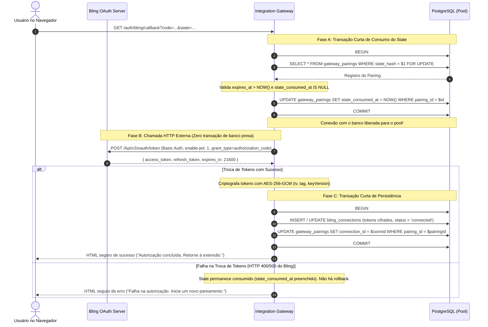
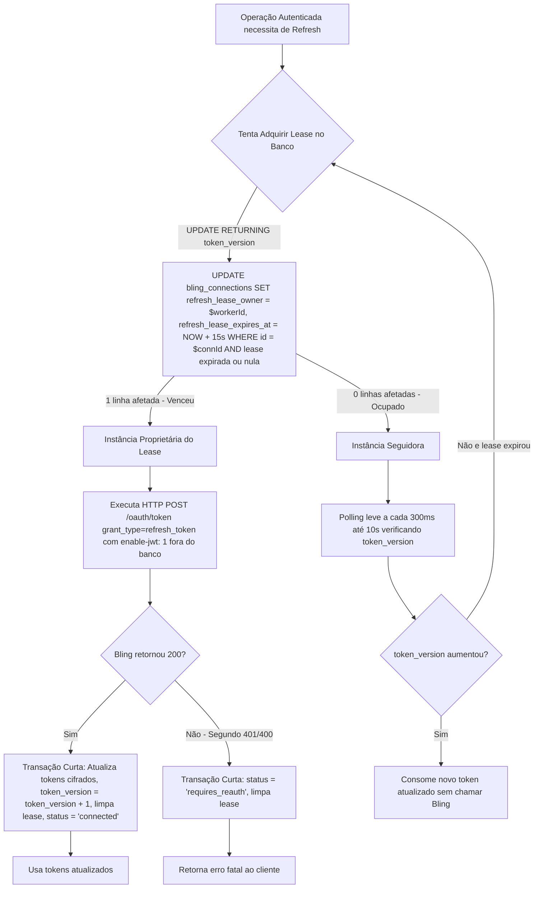

# Planejamento da Fase 4C.2: OAuth Real do Bling + Persistência Durável

## 1. Visão Geral e Fronteiras de Escopo

A **Fase 4C.2** transforma a fundação da Fase 4C.1 em um **Gateway com persistência durável em PostgreSQL** e **OAuth2 real perante o Bling ERP**.

### Objetivos Centrais:
- Persistência durável transacional (ACID) em PostgreSQL;
- Migrations reais, idempotentes e coordenadas via advisory lock;
- Fluxo OAuth2 completo e oficial da API v3 do Bling ERP;
- Troca do `authorization_code` por tokens reais com persistência criptografada em AES-256-GCM;
- Coordenação de refresh multi-instância via lease/claim sem bloqueio de conexões de banco durante chamadas HTTP externas;
- Ciclo de vida completo de Gateway Sessions com Gateway Session Token (GST) curto e Gateway Refresh Token (GRT) rotativo com detecção de reuso por família;
- Desconexão segura com purga efetiva das credenciais cifradas;
- Endpoints de status da integração e saúde do serviço.

### Fronteiras Rígidas de Escopo (O que NÃO pertence à 4C.2):
- **NENHUMA** leitura de produto pela extensão (o endpoint `/integrations/bling/products/:id` e a integração com o background script da extensão pertencem à Fase 4C.3);
- **NENHUMA** escrita ou alteração de dados no Bling;
- **NENHUMA** publicação ou chamada à API do Mercado Livre;
- **NENHUMA** credencial real versionada no repositório;
- **NENHUM** deploy em produção sem aprovação prévia.

---

## 2. Contratos Oficiais da API v3 do Bling ERP

Parâmetros validados na documentação oficial atual do [Bling Developer](https://developer.bling.com.br):

| Parâmetro | Contrato Oficial Bling API v3 | Status Documental |
| :--- | :--- | :--- |
| **Authorization Endpoint** | `https://www.bling.com.br/Api/v3/oauth/authorize` | Confirmado |
| **Parâmetros de Autorização** | `response_type=code`, `client_id={BLING_CLIENT_ID}`, `state={state}` | Confirmado |
| **Validade do Authorization Code**| **1 minuto** (troca imediata de uso único) | Confirmado |
| **Token Endpoint** | `POST https://api.bling.com.br/Api/v3/oauth/token` | Confirmado |
| **Content-Type do Token Endpoint** | `application/x-www-form-urlencoded` | Confirmado |
| **Header de Autenticação** | `Authorization: Basic {base64(client_id:client_secret)}` | Confirmado |
| **Header JWT Obrigatório** | `enable-jwt: 1` (obrigatório na emissão de token, refresh e chamadas à API) | Confirmado |
| **Header de Versão** | `Accept: 1.0` | Confirmado |
| **Body para Troca de Code** | `grant_type=authorization_code&code={code}` | Confirmado |
| **Body para Renovação de Token** | `grant_type=refresh_token&refresh_token={refresh_token}` | Confirmado |
| **Validade do Access Token** | **21.600 segundos (6 horas)** | Confirmado |
| **Validade do Refresh Token** | **30 dias** | Confirmado |
| **Comportamento no Refresh** | Retorna novo `access_token` **E** novo `refresh_token` (o anterior é invalidado no ato) | Confirmado |
| **Rate Limit no Token Endpoint** | **20 requisições por 60 segundos por IP** | Confirmado |
| **Rate Limit Geral da Conta** | **3 requisições por segundo / 120.000 requisições por dia** | Confirmado |
| **Revogação de Tokens via API** | **Não documentado / Inexistente** (desconexão é gerenciada no Gateway + instrução manual no painel Bling) | Não documentado |

---

## 3. Modelo Unificado: Pairing Efêmero e OAuth State

### 3.1. Princípio de Identidade do Fluxo: `pairingId` + `pairingSecret`
- `clientSessionId` representa a instalação da extensão e serve como metadado de auditoria e vínculo de contexto. **Nunca** é suficiente por si só para reivindicar uma sessão e **não** possui constraint `UNIQUE` no fluxo OAuth (uma instalação pode reiniciar o fluxo se o anterior expirar ou falhar).
- O segredo de prova de posse é o `pairingSecret` (256 bits CSPRNG em formato hex), mantido exclusivamente em memória efêmera na extensão. O Gateway armazena exclusivamente `SHA-256(pairingSecret)`.
- A inicialização via `POST /auth/bling/start` gera e retorna:
  ```json
  {
    "pairingId": "uuid-v4",
    "pairingSecret": "hex-64-chars",
    "authorizationUrl": "https://www.bling.com.br/Api/v3/oauth/authorize?response_type=code&client_id=...&state=..."
  }
  ```
- O handshake de conclusão via `POST /auth/bling/session` recebe:
  ```json
  {
    "pairingId": "uuid-v4",
    "pairingSecret": "hex-64-chars"
  }
  ```
  A busca é realizada estritamente por `pairingId`. É proibido localizar ou autorizar pairings usando apenas `clientSessionId`.

### 3.2. Tabela Unificada: `gateway_pairings`
```sql
CREATE TABLE IF NOT EXISTS gateway_pairings (
    pairing_id VARCHAR(64) PRIMARY KEY,
    client_session_id VARCHAR(128) NOT NULL,
    state_hash VARCHAR(64) NOT NULL UNIQUE,
    pairing_secret_hash VARCHAR(64) NOT NULL,
    connection_id VARCHAR(128) NULL REFERENCES bling_connections(id) ON DELETE SET NULL,
    state_consumed_at TIMESTAMPTZ NULL,
    pairing_consumed_at TIMESTAMPTZ NULL,
    attempt_count INT NOT NULL DEFAULT 0,
    expires_at TIMESTAMPTZ NOT NULL,
    created_at TIMESTAMPTZ NOT NULL DEFAULT NOW()
);

CREATE INDEX IF NOT EXISTS idx_pairings_state_hash 
    ON gateway_pairings (state_hash) 
    WHERE state_consumed_at IS NULL;

CREATE INDEX IF NOT EXISTS idx_pairings_client_session 
    ON gateway_pairings (client_session_id);
```

---

## 4. Ciclo de Callback do Bling (Transações Curtas sem Espera de Rede)

### Regra Crítica:
**Nunca manter uma transação de banco de dados aberta enquanto aguarda requisições HTTP externas ao Bling.**



Se a chamada ao Bling falhar (por exemplo, código com mais de 1 minuto ou resposta 400), o `state_consumed_at` permanece preenchido. O `state` nunca é reutilizado, impedindo replay attacks.

---

## 5. Coordenação Distribuída do Refresh Bling (Padrão Lease/Claim)

### 5.1. Problema dos Locks Tradicionais em Rede Externa
Segurar um `SELECT ... FOR UPDATE` no banco enquanto se faz uma requisição HTTP externa ao Bling:
1. Bloqueia uma conexão do pool por até 10-30 segundos em caso de lentidão da rede externa;
2. Pode causar esgotamento do pool de conexões (*connection pool starvation*);
3. Dificulta a recuperação se o processo travar no meio da chamada HTTP.

### 5.2. Mecanismo de Lease com Expiração e Versionamento
Na tabela `bling_connections`, incluímos colunas de concessão (*lease*) e controle de versão:
- `refresh_lease_owner VARCHAR(64) NULL`: Identificador único do worker/processo que reivindicou o refresh;
- `refresh_lease_expires_at TIMESTAMPTZ NULL`: Timestamp de expiração do lease (ex: 15 segundos);
- `token_version INT NOT NULL DEFAULT 1`: Número incremental da versão dos tokens armazenados.



### Vantagens do Padrão:
- **Zero conexões de pool presas** durante a chamada HTTP externa;
- **Tolerância a falhas/crashes**: se o worker que detém o lease morrer, o lease expira em 15 segundos sem bloquear indefinidamente o sistema;
- **Idempotência**: os workers concorrentes observam o incremento de `token_version` e apenas lêem o novo token descriptografado.

---

## 6. Schema Durável PostgreSQL e Política de Desconexão

### 6.1. Flexibilidade de Colunas de Tokens e Desconexão
Para garantir que a desconexão elimine efetivamente as credenciais em repouso sem violar integridade de banco, as colunas de cifragem são `NULLABLE`, protegidas por uma `CHECK CONSTRAINT`:

```sql
CREATE TABLE IF NOT EXISTS bling_connections (
    id VARCHAR(128) PRIMARY KEY,
    status VARCHAR(32) NOT NULL DEFAULT 'connected', -- 'connected' | 'requires_reauth' | 'disconnected'
    
    -- Colunas de tokens cifrados (NULLABLE para permitir purga no disconnect)
    access_token_cipher TEXT NULL,
    access_token_iv VARCHAR(64) NULL,
    access_token_tag VARCHAR(64) NULL,
    
    refresh_token_cipher TEXT NULL,
    refresh_token_iv VARCHAR(64) NULL,
    refresh_token_tag VARCHAR(64) NULL,
    
    key_version VARCHAR(32) NOT NULL DEFAULT 'v1',
    expires_at TIMESTAMPTZ NULL,
    scope VARCHAR(255) NULL,
    account_identifier VARCHAR(255) NULL,
    last_refresh_at TIMESTAMPTZ NULL,
    
    -- Coordenação de Refresh Distribuído
    refresh_lease_owner VARCHAR(64) NULL,
    refresh_lease_expires_at TIMESTAMPTZ NULL,
    token_version INT NOT NULL DEFAULT 1,
    
    created_at TIMESTAMPTZ NOT NULL DEFAULT NOW(),
    updated_at TIMESTAMPTZ NOT NULL DEFAULT NOW(),
    
    -- Constraint condicional de segurança
    CONSTRAINT chk_bling_connected_tokens 
        CHECK (status != 'connected' OR (access_token_cipher IS NOT NULL AND refresh_token_cipher IS NOT NULL AND expires_at IS NOT NULL))
);
```

### 6.2. Comportamento do `DELETE /integrations/bling` (Desconexão)
Na ação de desconexão:
1. `bling_connections` é atualizada:
   - `status = 'disconnected'`;
   - `access_token_cipher = NULL`, `access_token_iv = NULL`, `access_token_tag = NULL`;
   - `refresh_token_cipher = NULL`, `refresh_token_iv = NULL`, `refresh_token_tag = NULL`;
   - `refresh_lease_owner = NULL`, `refresh_lease_expires_at = NULL`;
   - `updated_at = NOW()`.
2. Todas as sessões (`gateway_sessions`) e tokens de refresh (`gateway_refresh_tokens`) associados àquela `connection_id` recebem `revoked_at = NOW()`.
3. Metadados de auditoria preservados: `id`, `created_at`, `updated_at`, `status = 'disconnected'`. Nenhum ciphertext de credencial é mantido.

---

## 7. Gateway Sessions & Refresh Tokens (Família e Reuso)

### 7.1. Schema de Sessões e Cadeia de Refresh Tokens
```sql
-- Sessões ativas do Gateway
CREATE TABLE IF NOT EXISTS gateway_sessions (
    id VARCHAR(64) PRIMARY KEY,
    connection_id VARCHAR(128) NOT NULL REFERENCES bling_connections(id) ON DELETE CASCADE,
    client_session_id VARCHAR(128) NOT NULL,
    revoked_at TIMESTAMPTZ NULL,
    created_at TIMESTAMPTZ NOT NULL DEFAULT NOW()
);

CREATE INDEX IF NOT EXISTS idx_sessions_conn ON gateway_sessions (connection_id);

-- Tokens de Refresh do Gateway (Rotação atômica com Token Family)
CREATE TABLE IF NOT EXISTS gateway_refresh_tokens (
    id VARCHAR(64) PRIMARY KEY,
    session_id VARCHAR(64) NOT NULL REFERENCES gateway_sessions(id) ON DELETE CASCADE,
    family_id VARCHAR(64) NOT NULL,
    token_hash VARCHAR(64) NOT NULL UNIQUE,
    used_at TIMESTAMPTZ NULL,
    revoked_at TIMESTAMPTZ NULL,
    expires_at TIMESTAMPTZ NOT NULL,
    created_at TIMESTAMPTZ NOT NULL DEFAULT NOW()
);

CREATE INDEX IF NOT EXISTS idx_grt_hash ON gateway_refresh_tokens (token_hash);
CREATE INDEX IF NOT EXISTS idx_grt_family ON gateway_refresh_tokens (family_id);
```

### 7.2. Lógica de Rotação e Detecção de Reuso (`POST /auth/session/refresh`)
Executada em transação atômica curta com lock na linha do token:
```sql
BEGIN;
SELECT id, session_id, family_id, used_at, revoked_at, expires_at
FROM gateway_refresh_tokens
WHERE token_hash = $1
FOR UPDATE;

-- Se o token já foi consumido (used_at IS NOT NULL):
-- DETECÇÃO DE REÚSO: Revoga a família inteira e a sessão
UPDATE gateway_refresh_tokens SET revoked_at = NOW() WHERE family_id = $familyId;
UPDATE gateway_sessions SET revoked_at = NOW() WHERE id = $sessionId;
COMMIT; -- Retorna HTTP 401 Unauthorized

-- Se o token for válido e inédito:
UPDATE gateway_refresh_tokens SET used_at = NOW() WHERE id = $id;
INSERT INTO gateway_refresh_tokens (id, session_id, family_id, token_hash, expires_at)
VALUES ($newId, $sessionId, $familyId, $newTokenHash, NOW() + INTERVAL '30 days');
COMMIT; -- Retorna novo GST e novo GRT
```

---

## 8. Migrations e Runner Transacional Idempotente

1. **Geração de IDs na Aplicação**: Todos os UUIDs e identificadores serão gerados pelo Node.js utilizando `crypto.randomUUID()`. Não há dependência de extensões do PostgreSQL como `pgcrypto` ou `uuid-ossp`.
2. **Lock Consultivo de Migração**: Para evitar que duas réplicas executem migrations concorrentemente na inicialização:
   ```sql
   SELECT pg_advisory_lock(hashtext('gateway_migrations_lock'));
   ```
   O lock é liberado explicitamente após o término do processo de migração.
3. **Execução Transacional e Idempotente**:
   Cada arquivo de migração roda dentro de um bloco `BEGIN ... COMMIT`. O registro na tabela `gateway_migrations` é persistido na mesma transação, garantindo atomicidade total em caso de falha de qualquer instrução DDL.

---

## 9. Gate Oficial de CI & Suíte de Testes com PostgreSQL Obrigatório

### 9.1. Diretriz de Execução:
- **Testes Unitários Locais**: Podem executar isoladamente com `InMemoryGatewayRepository` quando `DATABASE_URL` não for configurada.
- **CI Oficial da Fase 4C.2**: É **estritamente obrigatório** ter um serviço PostgreSQL ativo (via container de CI, Docker local ou `DATABASE_URL` dedicada). Um build verde que pulou os testes de PostgreSQL **NÃO** será aceito para fechamento.

### 9.2. Matriz de Cenários Obrigatórios contra PostgreSQL Real:

| Teste | Descrição da Validação |
| :--- | :--- |
| **Migrations e DDL** | Aplica migrations sequencialmente em banco limpo, reaplica de forma idempotente e valida constraints. |
| **Concorrência de State OAuth** | Múltiplas requisições concorrentes tentam consumir o mesmo `state_hash`; exatamente uma vence, as demais recebem erro. |
| **Concorrência de Pairing** | Múltiplas requisições tentam consumir o mesmo `pairingId` + `pairingSecret`; apenas uma emite sessão GST/GRT. |
| **Lease Concorrente no Refresh** | 5 requisições simultâneas solicitam renovação de tokens Bling expirados; apenas 1 adquire o lease; as 4 demais aguardam a versão atualizada e não chamam o Bling. |
| **Detecção de Reuso de GRT** | Apresentação de um `gatewayRefreshToken` já utilizado revoga na hora toda a família `family_id` e invalida a sessão ativa. |
| **Rollback Transacional** | Falha proposital em transação curta reverte alterações sem deixar registros órfãos ou inconsistentes. |
| **Purga no Disconnect** | Após `DELETE /integrations/bling`, valida que colunas de tokens e IVs tornaram-se `NULL` e sessões foram revogadas. |
| **Persistência Pós-Restart** | Desconecta e reconecta o pool do Gateway e valida que sessões e tokens criptografados continuam íntegros e decifráveis. |
| **Isolamento da Extensão** | O script `npm run verify:extension-isolation` confirma zero vazamento de código de backend ou segredos no bundle da extensão. |

---

## 10. Endpoints Oficiais da Fase 4C.2

```text
[GET]    /health                     -> Healthcheck geral e ping no PostgreSQL
[POST]   /auth/bling/start           -> Gera pairingId, pairingSecret e authorizationUrl
[GET]    /auth/bling/callback        -> Consome state (curto), troca code no Bling (rede), grava tokens (curto)
[POST]   /auth/bling/session         -> Consome pairingSecret (curto) e emite GST (15m) + GRT (30d)
[POST]   /auth/session/refresh       -> Rotação atômica de GST/GRT com detecção de reuso
[GET]    /integrations/bling/status  -> Retorna estado da conexão e metadados mínimos (Bearer GST)
[DELETE] /integrations/bling         -> Purga credenciais e invalida sessões da conta (Bearer GST)
```

---

## 11. Análise de Hospedagem (Gateway + PostgreSQL)

| Provedor | Custo Base | PostgreSQL Gerenciado | SSL/TLS Automático | Deploy Contínuo | Recomendação |
| :--- | :--- | :--- | :--- | :--- | :--- |
| **Render** | Free tier para Web Service; PostgreSQL gerenciado com injeção automática de `DATABASE_URL`. | Nativo na mesma região com alta performance. | Certificados automáticos em endpoints `*.onrender.com`. | Nativo conectado ao repositório GitHub (`main`). | **(Recomendado)** — Máxima simplicidade, isolamento seguro e sem complexidade de containers manuais. |
| **Railway** | $5/mês de créditos inclusos no plano Hobby. | Plugin de 1 clique. | Automático em `*.up.railway.app`. | Nativo via GitHub. | Excelente alternativa. |
| **Fly.io** | Pay-as-you-go via microVMs. | Não é banco gerenciado nativo (requer app Postgres com gestão manual). | Automático. | Requer CLI `flyctl`. | Complexidade desnecessária para o escopo. |

> [!NOTE]
> Nenhum provisionamento ou deploy em nuvem será realizado nesta fase de planejamento.

---

## 12. Critérios de Aceite Definitivos da Fase 4C.2

A Fase 4C.2 estará concluída com sucesso quando:
1. `PostgresGatewayRepository` estiver implementado e operacional com o driver `pg` nativo;
2. As migrations forem executadas de forma transacional e coordenada por advisory lock;
3. O fluxo de callback não prender conexões de banco durante a troca de authorization code com o Bling;
4. O refresh do Bling utilizar o padrão distribuído de lease/claim com tolerância a falhas e sem lock pessimista de rede;
5. A desconexão purgar efetivamente todos os dados sensíveis cifrados do banco de dados;
6. O Gateway Refresh Token rotacionar com sucesso e revogar a família inteira em caso de tentativa de reuso;
7. A suíte de testes contra PostgreSQL real passar com 100% de sucesso no gate oficial;
8. O gate `verify:extension-isolation` confirmar zero vazamentos de segredos ou dependências de backend no bundle da extensão;
9. Nenhuma leitura real de produtos pela extensão for conectada ainda (preservando o escopo para a 4C.3).
